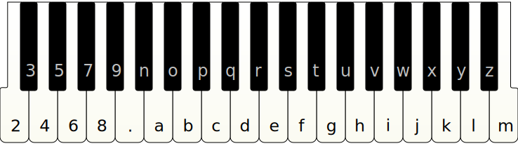

When discussing computer interfaces, few terms are more dangerous and in need of retiring from the vocabulary of clients and professionals than the word ‘intuitive.’

Search the web for ‘intuitive interface’ and you’ll see plenty of examples of the term being knocked about. No need to look around if you’re a designer, because you’ve already heard it from your clients, as in the ever-popular suggestion, ‘You just need to make it more intuitive.’

The problem is that ‘intuitive interfaces’ do not exist. It’s a made-up phrase people use to point in the general direction of something else they’re unable to articulate.

Claims of intuitiveness usually imply that an interface’s features blend effortlessly into a person’s existing workflow, requiring no conscious thought or prior knowledge about the interface.

This looks like a fine working definition at first blush — but it’s not. Attempting to establish ‘no prior knowledge’ is extremely complicated, and you cannot make assurances about intuition while requiring people to be taught.

This is why it’s absurd to say human intuition is enough to navigate a computer interface. It glosses over the basic fact that using a computer is itself a learned skill, since [nothing about interacting with a machine comes naturally to us](http://www.donotlick.com/2011/07/06/user-testing-in-the-wild-joes-first-computer-encounter/). In fact, few things are truly innate to a human being.[^1]

Praising an interface’s ‘intuitiveness’ is also problematic in that it obscures the fact that this quality does not depend on the interface alone. Since intuition applies to humans, whatever intuitiveness is, it must be determined by the relationship between machines and the people who use them. Such people may come from a variety of cultures, professional backgrounds, and learning experiences.

In a short essay for _Communications of the ACM_ in September 1994, interaction design pioneer Jef Raskin tells this story about the time he conducted an experiment using an early Apple computer, one of the first to include a mouse:

> My subject was an intelligent, computer-literate, university-trained teacher visiting from Finland who had not seen a mouse or any advertising or literature about it. With the program running, I pointed to the mouse, said it was ‘a mouse,’ and that one used it to operate the program. Her first act was to lift the mouse and move it about in the air. She discovered the ball on the bottom, held the mouse upside down, and proceeded to turn the ball. However, in this position the ball is not riding on the position pick-offs and it does nothing. After shaking it, and making a number of other attempts at finding a way to use it, she gave up and asked me how it worked. She had never seen anything where you moved the whole object rather than some part of it (like the joysticks she had previously used with computers): it was not intuitive. She also did not intuit that the large raised area on top was a button.

Raskin’s mouse episode should serve as a reminder that the abstractions we create for ourselves are not perceived the same way by everybody, and always require learning. It’s remarkably easy for an interaction designer who’s computer-savvy to mistake their deeply ingrained knowledge for intuition.

In order for an interface to require as little _new_ knowledge as possible, it must at least resemble a different but familiar interface, or map to processes that are already known to the operator. This is why interaction designers often use analogies and metaphors derived from existing tasks to convey meaning — like the concept of ‘cutting’ and ‘pasting’ content even though no actual scissors or glue are used.

The requirement for similarity leads Raskin to argue that ‘intuitiveness’ is, in fact, a misnomer:

> [I]t is clear that a user interface feature is ‘intuitive’ insofar as it resembles or is identical to something the user has already learned. In short, ‘intuitive’ in this context is an almost exact synonym of ‘familiar.’

Familiarity is a powerful force in interaction design. So powerful, in fact, it's made sure we’re saddled with design decisions from 150 years back that are now divorced from their original purpose.

Look in front of you. You’re probably seeing an example of what I'm talking about, the most common and also one of the oldest computer interfaces: the humble keyboard.

To understand the history of this peripheral, we need to travel a few centuries back in time and witness the development of its predecessor, the typewriter.

Although Henry Mill is on record as patenting a prototypal device in 1714, the typewriter as we know it today evolved over time and can’t be attributed to a single inventor. Many devices didn’t even look like typewriters: some early models had a dial, until inventors decided a keyboard would be more convenient.

Typewriters surged in popularity during the 19th century, following the productivity increases brought on by mechanisation in the workplace. In spite of this, they didn’t enter into mass production until Danish inventor Rasmus Malling-Hansen introduced the Writing Ball in 1870. The Hansen Writing Ball was a peculiar-looking device: it obscured the paper it operated on and, most strikingly, its keys were arranged on a hemispherical head. Was it ‘intuitive?’ It certainly didn’t stop it from being widely sold.

Roughly at the same time as Hansen, American inventor Christopher Latham Sholes, together with Carlos Glidden, Samuel Willard Soulé, and James Densmore, was working on a related device. The keys on their first prototype were repurposed from a piano, in two rows of ivory and ebony, and heavily inspired by the existing Hughes-Phelps Printing Telegraph. More on the telegraph in a while — for now, I merely wish to draw your attention to its keyboard layout:

Yes, in the Sholes & Glidden prototype, keys were arranged _alphabetically_.

People in the Western world have long been taught from a tender age to recite the alphabet in a particular order, and this order being familiar, it made perfect sense to adopt it for the typewriter.

So, why aren’t keys sorted alphabetically in today’s keyboards?

A popular explanation is that a severe flaw in its design made the typewriter prone to jamming: when adjacent keys were pressed in quick succession, their typebars — the metal arms that struck characters through an ink ribbon onto the page — would stick, forcing typists to stop their work to disentangle them. Although quite familiar, the alphabetical key layout turned out to be incompatible with the typebar mechanism because too many English words required hitting adjacent keys to type.

Sholes spent years redesigning the typewriter’s keyboard and reinforcing its build to mitigate the problem. Using statistical knowledge of the English language, he made sure that common digrams — that is, letter pairs like TH or ER — would not be found in keys that were too close together. After some experimentation, he came upon an arrangement similar to what we now recognise as the QWERTY layout.

It’s a compelling story, but [Koichi Yasuoka and Motoko Yasuoka of Kyoto University dispute this version of events](http://kanji.zinbun.kyoto-u.ac.jp/~yasuoka/publications/PreQWERTY.html). In a 2011 paper, they reason that the ER/RE pairing, the fourth most frequent in English, still corresponds to adjacent keys on a QWERTY keyboard, invalidating the argument that a faulty mechanism was to blame. There had to be other influences at work.

You see, keyboards weren’t used just for impressing characters upon paper.

Telegraphs, which evolved around the same period, relied on messages being transmitted in Morse code, a system of encoding where prearranged sequences of _dots_ (a short mark) and _dashes_ (a longer mark) translate to letters in the Latin alphabet. Earlier telegraphs had a switch to relay these marks down a wire as electrical pulses, which then caused a magnet to click on the receiving device. This magnet was sometimes fitted with a stylus that pushed grooves onto a running paper tape, so it left a physical record of the message as well. When the telegraph adopted radio technology, the marks began to be transmitted as audible signals and required acute listening skills from the operator to filter a quick succession of _dits_ and _dahs_ out of the background noise.

What Koichi Yasuoka and Motoko Yasuoka conclude from their research is that QWERTY emerged by request of telegraph operators, who were among the first to test and use the typewriter. People who transcribed Morse code messages on the receiving end had to work quickly to keep up with the sender, and they suggested many changes to streamline their work. For example:

> T, the most frequently-used consonant, should have moved to the center of keyboard, W, the other semivowel, to the upper row, Q, less frequently-used letter, to the edge, and I, also used for the numeral 1, near by 8 to type ‘1870’ or ‘1871’ rapidly. S should have moved in between Z and E because of the ambiguity of American Morse Code. The code represents Z as ‘· · · ·’ which is often confused with the digram SE, more frequently-used than Z. Sometimes Morse receivers in United States cannot determine whether Z or SE is applicable, especially in the first letter(s) of a word, before they receive following letters. Thus S ought to be placed near by both Z and E on the keyboard for Morse receivers to type them quickly.

Whatever the method, sending and receiving telegrams required operators to be fluent in Morse code, but skilled operators were hard to train or come by. You also needed two people for the job, one at each end of the line.

To take the pain out of sending messages, and to send them more efficiently, the typewriter had a cousin in the teletype. The teletype used a keyboard to emit specific signals, which caused a wheel made out of typebars to turn by degrees at the receiving end. This wheel then punched the typed characters on a piece of paper. Although early teletypes were temperamental and frequently broke down, operators were trained typists who didn’t need to know any Morse code at all to use them. In time, the keyboard design on these inventions converged, as they depended on the each other’s traction to reap the benefits of familiarity.

Christopher Shole’s partners eventually dropped out of the typewriter project, and after much bitter disappointment Sholes sold his invention to the E. Remington & Sons company. Remington’s acquisition led to the tremendously popular No. 1 and No. 2 models, and prompt adoption of the QWERTY layout by the public as well as competing manufacturers ensured the decades-long perpetuation of its design. By 1890, the company had sold over 100,000 typewriters across America, and before the 20th century QWERTY had solidified as a _de facto_ standard.[^2]

Keyboards eventually lost their spindly mechanical levers as engineers adapted the teletype into an input device for electronic computers. With mass adoption of touchscreen devices, keyboards even lost their actual physical keys. Yet the QWERTY layout survives, and even ergonomic improvements like the ones introduced by August Dvorak in the 1930s or Shai Coleman in the 2000s did little to displace it, having only been embraced by a minority of enthusiasts.

* * *



I picked the keyboard to illustrate my point because it’s such an obviously _unintuitable_ device, yet we keep returning to it even as the technology around it is overhauled. The keyboard on your smartphone’s touchscreen doesn’t look the way it does because its typebars might get jammed, or because someone still needs to decode Morse quickly, or because the layout is somehow better suited to thumb typing. The reason its design has not changed in over a century is simply that it became too familiar to be abandoned,[^3] and familiarity trumps many things in interface design.

_Familiarity._ That’s your go-to word if you ever feel the discussion is in danger of being taken over by sloppy terminology. Allow the ‘intuitive interface’ claptrap into your professional vocabulary and you will be at the mercy of what ‘feels right’ to your client before they accept your work. The terms of your compensation should be determined by objective criteria, not your clients’ gut instinct.

Raskin adds:

> Even where my proposals are seen as significant improvements, they are often rejected nonetheless on the grounds that they are not intuitive. It is a classic ‘catch 22.’ The client wants something that is significantly superior to the competition. But if superior, it cannot be the same, so it must be different (typically the greater the improvement, the greater the difference). Therefore it cannot be intuitive, that is, familiar. What the client usually wants is an interface with at most marginal differences that, somehow, makes a major improvement. This can be achieved only on the rare occasions where the original interface has some major flaw that is remedied by a minor fix.

Designing for familiarity provides a sturdier framework for your projects than intuition. It forces you to admit your intended public is _not_ universal, giving you some much needed focus. More importantly, though, it encourages you to get to know your audience, and understand what is familiar and meaningful to them.

Think about the times you threw your arms up in frustration because users did something stupid. Maybe you even laughed at them. But rather than blame them, blame the unrealistic expectations you held. They may not be your ideal customers — they may even be as inept as you think — but the knowledge you take for granted is not shared by everybody, and may even confuse some. If your target audience is unprepared to use an interface, then not having closed that knowledge gap is your own fault.

Mind that gap, and avoid designing for an audience who exists only inside your head. To create an interface that’s familiar to people, it helps first of all to make those people familiar to you.

[^1]: If any. The jury is still out on psychological nativism, which concerns itself with instinctual knowledge and is a great subject for some other time. Even so, researchers like Noam Chomsky and Steven Pinker have focused primarily on linguistic ability, not the knack for pressing buttons and pointing cursors at rectangles on a screen. Other people may _feel_ there must be some magical way of acquiring knowledge, but the least helpful approach to an eminently empirical field like computer interface design is to start invoking the supernatural. Best not to rely on some extraordinary ability to draw knowledge from a Platonic reservoir of memories or shared universal consciousness.

[^2]: A few countries developed slightly adjusted layouts better suited to their languages, like the AZERTY layout for French and QWERTZ for German. [In 1937, Portugal’s dictatorship devised the significantly different HCESAR layout](https://dre.pt/application/dir/pdf1sdip/1937/07/16500/06910692.pdf), which hung around until the rise of imported personal computers in the 1980s caused it to fall out of favour.

[^3]: Economists call the overwhelming weight of history in current circumstances _[path dependence](http://www.econ.ucsb.edu/%7Etedb/Courses/Ec100C/DavidQwerty.pdf)._ You may think of it as a hangover that takes decades to wear off.
